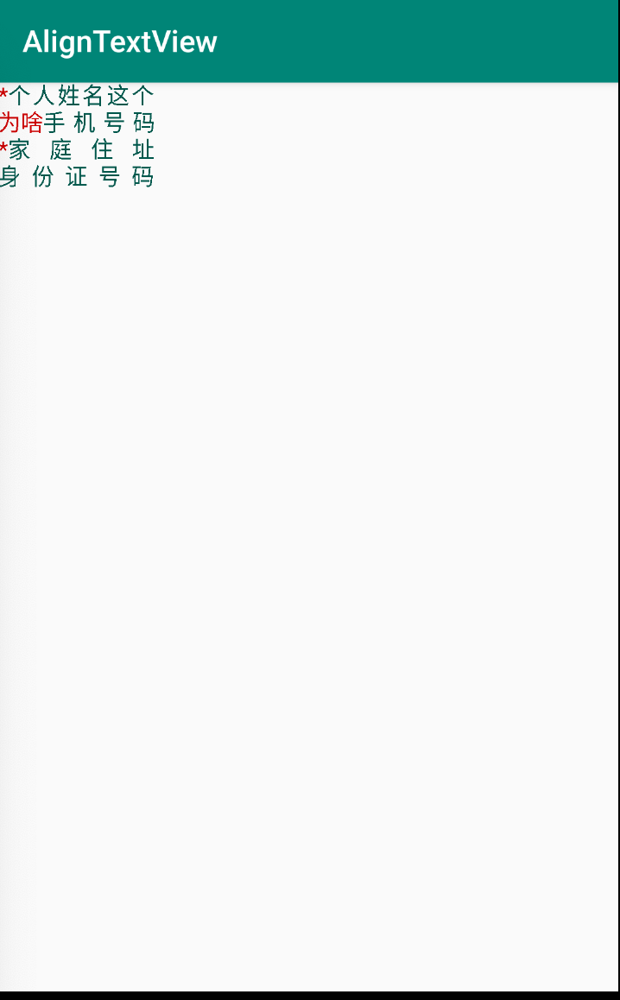

# AlignTextView

这是一款可以自动左右对齐的TextView，支持自动计算模式「 目前只支持LinearLayout 和 RelativeLayout 」和手动配置模式。

### 效果如图：



### 如何使用：

1. 添加配置

   ```groovy
   implementation 'com.ccsf:AlignTextView:1.0.0'	
   ```

2. 在布局文件中添加代码，自动配置模式：使用 `AutoAlignLinearLayout`  或者 `AutoRelativeLayout` 

   ```xml
   <?xml version="1.0" encoding="utf-8"?>
   <com.ccsf.aligntextview.AutoAlignRelativeLayout xmlns:android="http://schemas.android.com/apk/res/android"
       xmlns:app="http://schemas.android.com/apk/res-auto"
       android:layout_width="match_parent"
       android:layout_height="match_parent"
       app:rl_child_font_size="15sp"> // 当父布局配置了size，以父布局为主
       <com.ccsf.aligntextview.AlignTextView
           android:id="@+id/atv2"
           android:layout_width="match_parent"
           android:layout_height="match_parent"
           android:layout_below="@id/atv1"
           app:color="@color/colorPrimaryDark"
           app:font_size="15sp" // 当父布局配置了size，以父布局为主
           app:pre_color="@android:color/holo_red_dark"
           app:pre_text="为啥"
           app:text="手机号码" /> 
       <com.ccsf.aligntextview.AlignTextView
           android:id="@+id/atv4"
           android:layout_width="wrap_content"
           android:layout_height="wrap_content"
           android:layout_below="@id/atv3"
           app:color="@color/colorPrimaryDark"
           app:pre_color="@android:color/holo_red_dark"
           app:text="身份证号码" /> 
   
   </com.ccsf.aligntextview.AutoAlignRelativeLayout>
   ```

   手动配置模式：可配置单个 `AlignTextView` 

   ```xml
      <com.ccsf.aligntextview.AlignTextView
           android:id="@+id/atv4"
           android:layout_width="wrap_content"
           android:layout_height="wrap_content"
           android:layout_below="@id/atv3"
           app:max_length="11" //配置最大的字数，记住是「pre_text」和「text」加起来的字数
           app:color="@color/colorPrimaryDark"
           app:pre_color="@android:color/holo_red_dark"
           app:font_size="15sp"
           app:text="身份证号码" /> 
   ```

   

### 	